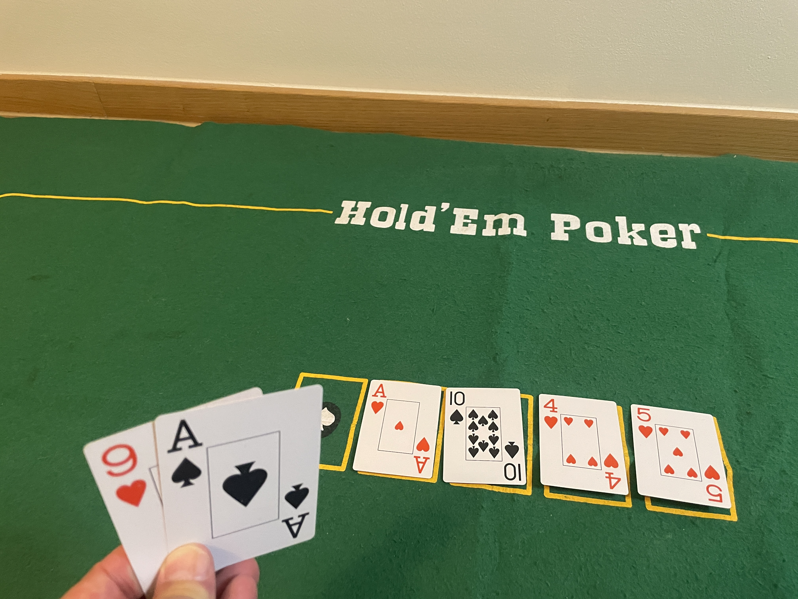
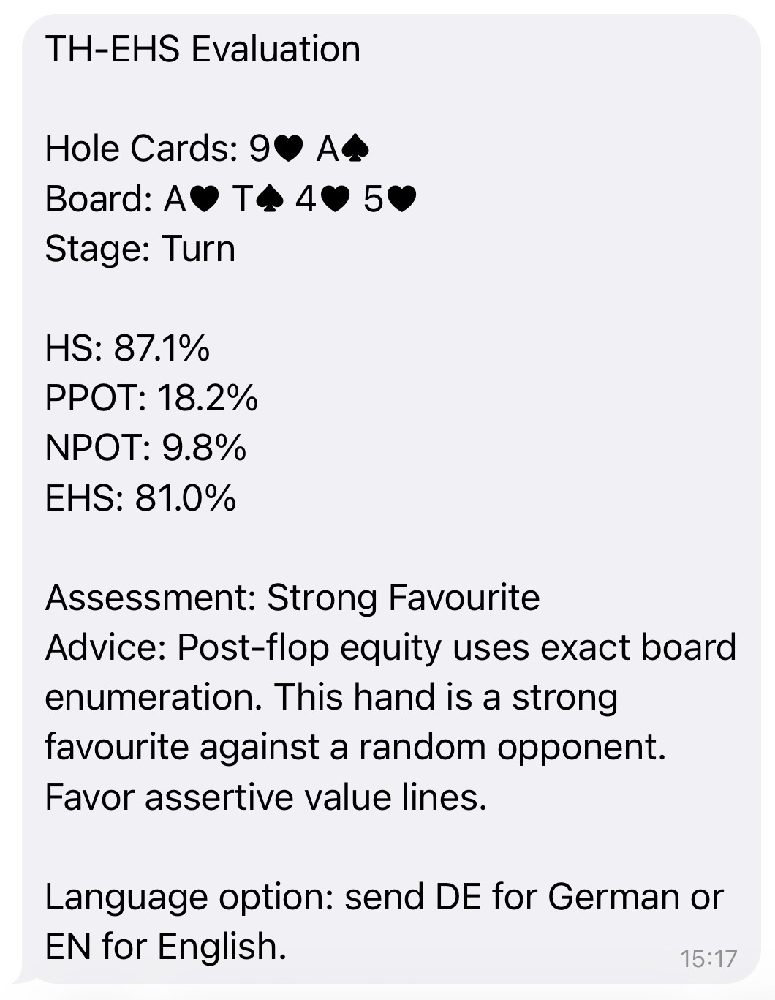

# TH-EHS2

A Telegram bot that evaluates Texas Hold'em poker hands from photos. Send a picture of your cards and the board — the bot recognizes the cards via vision and returns precise equity metrics (HS, EHS, PPot, NPot) with a plain-language assessment.

## Demo

**Input** — photo sent to the bot:



**Output** — bot reply in Telegram:



The example shows hole cards **9♥ A♠** on a Turn board of **A♥ T♠ 4♥ 5♥**. The bot identifies the cards, runs exact board enumeration, and returns:

| Metric | Value | Meaning |
|---|---|---|
| HS | 87.1% | Wins against 87% of random hands right now |
| PPot | 18.2% | Chance of improving if currently behind |
| NPot | 9.8% | Chance of losing if currently ahead |
| **EHS** | **81.0%** | Overall winning probability across all remaining runouts |

> See [docs/ehs_explainer.md](docs/ehs_explainer.md) for a full explanation of how EHS is calculated and when to use it.

## How It Works

1. User sends a photo of hole cards + board to the Telegram bot.
2. GPT-4 Vision recognizes the cards and detects the street (Flop / Turn / River).
3. Deterministic TypeScript code computes HS, PPot, NPot, and EHS — no AI is used for the math.
4. The bot replies with the metrics and a plain-English assessment.

The bot supports English and German (`EN` / `DE`).

## Local Development

```bash
npm install
npm test
npm run build
```

Create a local `.env` from `.env.example` and set the required values.

## Environment Variables

| Variable | Description |
|---|---|
| `TELEGRAM_BOT_TOKEN` | Bot token from @BotFather |
| `TELEGRAM_WEBHOOK_SECRET` | Secret for webhook validation |
| `OPENAI_API_KEY` | Used for card recognition only |
| `OPENAI_MODEL` | Defaults to `gpt-4.1` |
| `ALLOWED_USER_IDS` | Optional comma-separated Telegram user IDs |
| `MONTE_CARLO_ITERATIONS` | Defaults to `50000` |
| `NODE_ENV` | Runtime environment |

## Vercel Deployment

The webhook route is exposed at `/api/telegram`. Set the same environment variables in Vercel before deploying.

### Register the Telegram Webhook

```bash
curl -X POST "https://api.telegram.org/bot$TELEGRAM_BOT_TOKEN/setWebhook" \
  -d "url=https://YOUR_VERCEL_DOMAIN/api/telegram" \
  -d "secret_token=$TELEGRAM_WEBHOOK_SECRET"
```

## Implementation Rules

- Vision is used only for card recognition — all poker math is deterministic TypeScript.
- EHS, HS, PPot, NPot, hand ranking, and equity are computed without any AI inference.
- The application does not store images, users, hands, or results.
